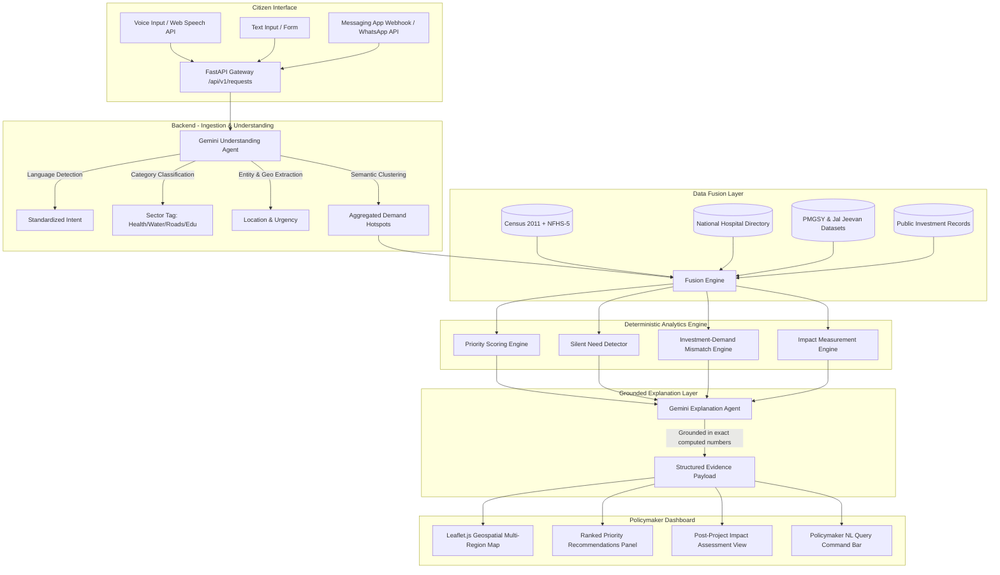

# System Architecture Blueprint — Development Priority Intelligence

## 1. Architectural Philosophy

1. **Separation of Arithmetic and Natural Language:**
   - **Deterministic Engines compute:** Priority Scores, Silent Need flags, Investment Mismatches, and Impact Percentages are computed exclusively in deterministic Python code. Gemini is **never** asked to perform mathematical calculations.
   - **Gemini explains:** Gemini takes the computed figures, verified data citations, and localized context to generate objective, natural-language justifications for policymakers.
2. **Privacy & Security First:**
   - All API keys, database credentials, and GenAI client configurations reside strictly inside the FastAPI backend. The frontend client never touches the Gemini API key.
3. **Multi-Region & Cross-Border Generalization:**
   - The platform operates on a generic 4-tier administrative hierarchy (`Admin 0` through `Admin 3`), making it directly deployable across BRICS member states.

---

## 2. End-to-End Data Flow

---

## 3. The 4 Analytical Engines (Plain Python Implementation)

### 3.1. Priority Scoring Engine
Calculates an objective score from 0 to 100 for every sector and administrative unit:
$$\text{Priority Score} = \min\left(100, \, w_1 \cdot \text{Demand} + w_2 \cdot \text{PopAffected} + w_3 \cdot \text{InfraDeficit} + w_4 \cdot \text{AccessDeficit} - w_5 \cdot \text{ExistingInvestment}\right)$$
- **Demand:** Number of clustered citizen complaints normalized by time and population.
- **PopAffected:** Target demographic slice (e.g., rural population, women/infant cohort).
- **InfraDeficit:** Existing facilities per capita compared to national minimum standard.
- **AccessDeficit:** Average travel distance to nearest operational facility.
- **ExistingInvestment:** Inverse scaling of active/ongoing capital expenditures in the target sector.

### 3.2. Silent Need Detector
Flags regions with acute socioeconomic vulnerability but disproportionately low digital complaint volumes (often caused by low digital literacy, poor connectivity, or marginalized communities):
$$\text{Silent Need Flag} = \text{True} \quad \text{if } \text{InfraDeficit} \ge \tau_{\text{high}} \quad \text{and} \quad \text{ReportedDemand} \le \tau_{\text{low}}$$
Surfaces alerts like: *"High risk of underreporting in Block X — severe healthcare deficit detected despite minimal digital complaints."*

### 3.3. Investment–Demand Mismatch Engine
Identifies misaligned public finance:
- **Underfunded Hotspot:** High Citizen Demand + High Infrastructure Deficit + Zero/Low Ongoing Capital Outlay.
- **Ineffective Expenditure Warning:** High Existing Investment + Persistent or Increasing Citizen Complaints.

### 3.4. Impact Measurement Engine (Before vs. After)
Directly answers the third clause of the official brief.
For any public project marked as `"Completed"` in the government records with completion timestamp $T_{\text{complete}}$:
1. Calculates $\text{Complaints}_{\text{Pre}}$ and $\text{PriorityScore}_{\text{Pre}}$ in the interval $[T_{\text{complete}} - \Delta t, T_{\text{complete}}]$.
2. Calculates $\text{Complaints}_{\text{Post}}$ and $\text{PriorityScore}_{\text{Post}}$ in the interval $[T_{\text{complete}}, T_{\text{complete}} + \Delta t]$.
3. Computes the **Measured Impact Delta**:
$$\text{Impact Ratio} = \frac{\text{Complaints}_{\text{Pre}} - \text{Complaints}_{\text{Post}}}{\text{Complaints}_{\text{Pre}}} \times 100\%$$
Clearly labeled in the dashboard: *"Based on available post-commissioning reporting data."*

---

## 4. BRICS Generic Administrative Hierarchy

To ensure cross-border reusability across India, Brazil, South Africa, and other nations, the schema abstracts geography into standardized levels:

| Generic Level | India Implementation | Brazil Example | South Africa Example |
| :--- | :--- | :--- | :--- |
| **Admin 0 (Country)** | India (`IND`) | Brazil (`BRA`) | South Africa (`ZAF`) |
| **Admin 1 (State / Province)** | State (e.g. Maharashtra, UP) | State (e.g. São Paulo, Bahia) | Province (e.g. Gauteng) |
| **Admin 2 (District / Municipality)**| District (e.g. Pune, Varanasi) | Municipality (Município) | District Municipality |
| **Admin 3 (Sub-District / Locality)**| Taluka / Block / Ward | Bairro / Distritos | Local Municipality / Ward |

Adapting the platform to a new nation requires only changing configuration files and loading country-specific open data. The entire backend ingestion, agent processing, and scoring logic remain untouched.
